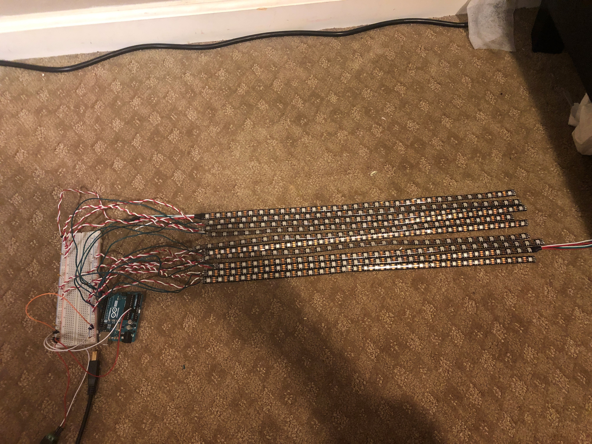

Project Description:

This project was inspired through a hobby of mine, DJing. With lighting equipment being very expensive, I wanted to find an inexpenseive
way to decorate my mobile DJ set up for future gigs.

This project was made using:

  BTF-LIGHTING WS2812B RGB(300 pixel) LED Strip
  Arduino Mega
  5V Power Supply
  Bread Board
  Jumper Wires
  
Project Timeline:

  1. Connecting the single LED strip to power
  2. Reading and figuring out the FASTLed library
  3. Creating Custom Effects using a single LED strip through Arduino
  4. Cutting LED stip into 10x30 strips
    a. Soldering Jumper Wires to each indivual strip
    b. Connect each strip to an Arduino pin
  5. Realized using a computer for the Arduino and LED strips as a power supply is not sufficient enough
    a. Connected an external 5V power supply to a breadboard
    b. Arduino and LED strips are now powered seperately
  6. Creating Custom 2D LED panel effects

Future Features:
In the future, I want to be able to control the the LED panel through a MIDI keyboard. This would utilize
a seperate Ardunio to take inputs from the MIDI and outputting that data to the LED panel's Arduino

LED Panel System

              ---Below are GIFS of some of the implemented effects---

Iterate Through Color Wheel

Pulse Effect

Moving Wave

Moving Eye

Strobe Preset

Personal Logo Moving Animation

